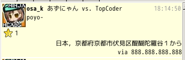

# mikutter-geocode

## What's this
位置情報付きのツイートに、その住所を逆引きして表示します。
逆引きにはGoogle Geocoding APIを利用しています。

https://developers.google.com/maps/documentation/geocoding/?hl=ja

## Install
[osa\_k\_store](http://github.com/osak/osa_k_store) を導入してみっくストア経由で入れるか，もしくは

    git clone git://git.github.com/osak/mikutter-geocode.git ~/.mikutter/plugin/geocode

## How To
導入すると、位置情報付きツイートの住所がツイートに付加されるようになります。

また、このプラグイン単体でGeocoding APIへのアクセスを提供しています。
`Plugin.filtering(:geocode, latitude, longitude, [])`のように呼び出すと、最後の引数に住所が入って返ってきます。

## Settings
- 表示言語：住所を表示する言語を指定します（デフォルト：ja）

## License
Copyright (c) 2013 Koga Osamu

MIT License

Permission is hereby granted, free of charge, to any person obtaining
a copy of this software and associated documentation files (the
"Software"), to deal in the Software without restriction, including
without limitation the rights to use, copy, modify, merge, publish,
distribute, sublicense, and/or sell copies of the Software, and to
permit persons to whom the Software is furnished to do so, subject to
the following conditions:

The above copyright notice and this permission notice shall be
included in all copies or substantial portions of the Software.

THE SOFTWARE IS PROVIDED "AS IS", WITHOUT WARRANTY OF ANY KIND,
EXPRESS OR IMPLIED, INCLUDING BUT NOT LIMITED TO THE WARRANTIES OF
MERCHANTABILITY, FITNESS FOR A PARTICULAR PURPOSE AND
NONINFRINGEMENT. IN NO EVENT SHALL THE AUTHORS OR COPYRIGHT HOLDERS BE
LIABLE FOR ANY CLAIM, DAMAGES OR OTHER LIABILITY, WHETHER IN AN ACTION
OF CONTRACT, TORT OR OTHERWISE, ARISING FROM, OUT OF OR IN CONNECTION
WITH THE SOFTWARE OR THE USE OR OTHER DEALINGS IN THE SOFTWARE.
